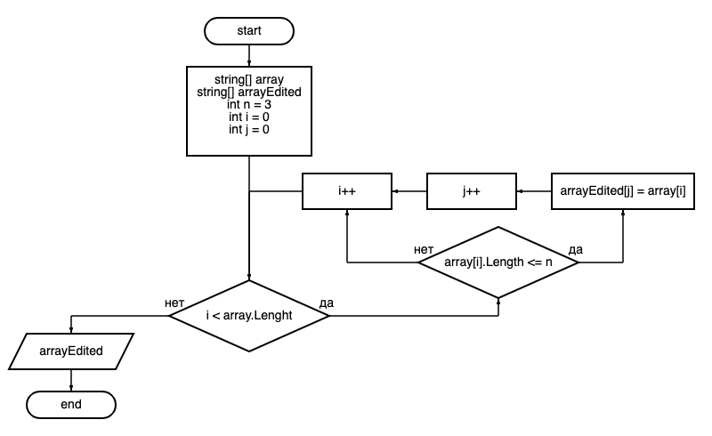

# Итоговая проверочная работа

### __Задача__: *Написать программу, которая из имеющегося массива строк формирует массив из строк, длина которых меньше либо равна 3 символа. Первоначальный массив можно ввести с клавиатуры, либо задать на старте выполнения алгоритма. При решении не рекомендуется пользоваться коллекциями, лучше обойтись исключительно массивами.*
### __Примеры:__ 
*["hello", "2", "world", ":-)"] -> ["2", ":-)"]  
["Russia", "Denmark", "Kazan"] -> []*

## Описание решения
1. Задать основной массив строк
2. Вычислить количество элементов заданного массива, удовлетворяющих условию задачи, для определения длины нового массива:
    * задать переменную счетчика, равную нулю
    * пройти циклом по каждому элементу заданного массива и проверить его длину: если она меньше либо равна 3, увеличить значение переменной счётчика на 1
    * вернуть значение переменной счетчика
3. Сформировать итоговый массив:
    * задать новый массив строк с длиной, вычисленной в п.2
    * пройти циклом по каждому элементу основного массива и проверить его длину: если она меньше либо равна 3, записать этот элемент в новый массив
    * вернуть новый массив
4. Вывести итоговый массив

## Блок-схема основного алгоритма:
